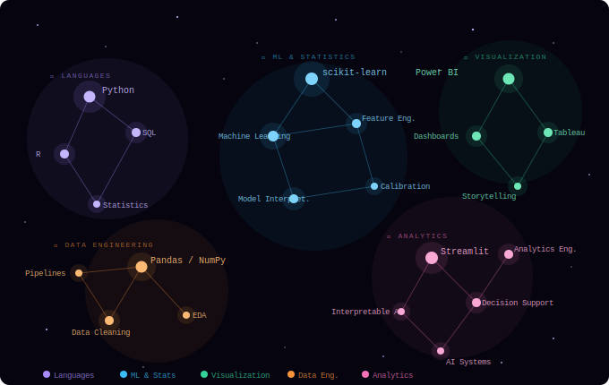

<div align="center">


<br/>

```
 ██████╗██╗  ██╗███████╗████████╗ █████╗ ███╗   ██╗
██╔════╝██║  ██║██╔════╝╚══██╔══╝██╔══██╗████╗  ██║
██║     ███████║█████╗     ██║   ███████║██╔██╗ ██║
██║     ██╔══██║██╔══╝     ██║   ██╔══██║██║╚██╗██║
╚██████╗██║  ██║███████╗   ██║   ██║  ██║██║ ╚████║
 ╚═════╝╚═╝  ╚═╝╚══════╝   ╚═╝   ╚═╝  ╚═╝╚═╝  ╚═══╝
```

<a href="https://git.io/typing-svg">
  
</a>

<br/><br/>


&nbsp;

&nbsp;


</div>

<br/>


<br/>

<!-- ══════════════════════════════════════════ -->
<!--              IDENTITY BLOCK               -->
<!-- ══════════════════════════════════════════ -->

<div align="center">

### `〔  SIGNAL PROFILE  〕`

</div>

<br/>

```python
class Chetan:

    identity   = ["Data Scientist", "Statistical Thinker",
                  "ML Architect", "Analytics Engineer"]

    location   = "Edmonton, Alberta, Canada 🍁"
    education  = ["M.Sc. Data Science — Modeling, Data & Predictions",
                  "M.Sc. Mathematics"]

    philosophy = """
        I don't memorize — I reason.
        I don't just model — I explain.
        I build systems that understand *why*,
        not just systems that predict *what*.
    """

    interests  = ["Interpretable ML", "Statistical Modeling",
                  "Decision-Support Systems", "Educational AI",
                  "Data Storytelling", "Interactive Analytics"]

    currently  = "Engineering AI systems that make complex things clear."
```

<br/>


<br/>

<!-- ══════════════════════════════════════════════════════════════════════ -->
<!--   SKILL CONSTELLATIONS                                                -->
<!--                                                                       -->
<!--   HOW TO SET UP (one-time, 2 minutes):                                -->
<!--   1. Upload constellation.svg into this same repo (root folder)       -->
<!--   2. The  below references it by relative path — it will         -->
<!--      render with full SMIL animation on your GitHub profile page.     -->
<!--      GitHub renders SVG files as animated images when loaded via img. -->
<!-- ══════════════════════════════════════════════════════════════════════ -->

<div align="center">

### `〔  INSTRUMENT ARRAY — SKILL CONSTELLATIONS  〕`

<br/>



</div>

<br/>

<div align="center">

**Languages &amp; Runtimes**


**ML · Modeling · Statistics**


**Dashboards · Visualization**


**Tools &amp; Environment**


</div>

<br/>


<br/>

<!-- ══════════════════════════════════════════ -->
<!--         PROJECT CONSTELLATION             -->
<!-- ══════════════════════════════════════════ -->

<div align="center">

### `〔  PROJECT CONSTELLATION  〕`

*Selected missions from the data observatory*

</div>

<br/>

<table>
<tr>
<td width="50%" valign="top">

### 🛡️ Fraud Detection Intelligence Dashboard
> *Risk Scoring · ML Classification · Decision Triage*

An end-to-end insurance fraud risk scoring pipeline with a live Streamlit interface. Built to surface high-risk claims using calibrated classification models with tunable decision thresholds — outputs are oriented around business triage, not just model scores.

**Architecture:**
- `Classification` — Fraud risk scoring model
- `Calibration` — Threshold tuning for precision/recall tradeoff
- `Dashboard` — Interactive Streamlit interface for claims officers
- `Output` — Business-ready risk tiers and triage queues


</td>
<td width="50%" valign="top">

### ✈️ Airline Route Profitability Engine
> *Route Analytics · Strategic Classification · BI*

A route-level analytics engine that classifies airline paths into decision categories — **Maintain / Optimize / Expand / Drop** — using profitability signals and performance modeling. Designed for strategic decision-support with dashboard-first output.

**Architecture:**
- `Route Segmentation` — Multi-factor classification model
- `Decision Mapping` — Four-tier strategic outcome categories
- `Visualization` — Route-level analytics dashboard
- `Output` — Actionable business recommendations


</td>
</tr>
<tr>
<td width="50%" valign="top">

### 🧠 Mental Health Risk Modeling
> *Predictive Modeling · Feature Integrity · Interpretability*

A survey-driven predictive risk model built with rigorous feature engineering discipline. Eliminated **400+ data-leaking features** to build a clean, generalizable model. Prioritized interpretability and honest evaluation over inflated benchmark metrics.

**Architecture:**
- `Feature Audit` — Systematic leakage detection and removal
- `Modeling` — Calibrated classification (ROC-AUC ~0.75)
- `Interpretability` — SHAP-informed feature importance
- `Output` — Explainable risk signals with clinical context


</td>
<td width="50%" valign="top">

### 🌌 AXIOM
#### *Adaptive eXplanatory Intelligence for Ontological Mastery*
> *In Development · AI · Education · Reasoning Engine*

An AI-powered learning and analytics system that teaches complex topics through intuition and structured reasoning — not rote explanation. Built for people who want to understand *why*, not just recall *what*.

**Vision:**
- `Reasoning Engine` — Concept maps over answers
- `Adaptive Learning` — Tailored to how *you* think
- `Game Mechanics` — Activity-based knowledge reinforcement
- `Transparency` — Every explanation shows its reasoning chain

> *"The goal isn't to know the answer. It's to understand the question."*


</td>
</tr>
</table>

<br/>


<br/>

<!-- ══════════════════════════════════════════ -->
<!--           ACTIVE TRANSMISSIONS            -->
<!-- ══════════════════════════════════════════ -->

<div align="center">

### `〔  ACTIVE TRANSMISSIONS  〕`

</div>

<br/>

<div align="center">

| Signal | Frequency |
|:------:|-----------|
| 🔬 | **Interpretable ML** — designing models that explain themselves, not just predict |
| 🧩 | **AXIOM System** — building a reasoning-first AI learning architecture |
| 📊 | **Decision Dashboards** — analytics interfaces that guide action, not just display data |
| 🎲 | **Game-Based Learning** — encoding statistical intuition into interactive experiences |
| 📐 | **Statistical Depth** — going deeper on Bayesian thinking and probabilistic reasoning |

</div>

<br/>


<br/>

<!-- ══════════════════════════════════════════ -->
<!--           OBSERVATORY METRICS             -->
<!-- ══════════════════════════════════════════ -->

<div align="center">

### `〔  OBSERVATORY METRICS  〕`

<br/>


&nbsp;&nbsp;


<br/><br/>


<br/><br/>


</div>

<br/>


<br/>

<!-- ══════════════════════════════════════════ -->
<!--           OPERATING PRINCIPLE             -->
<!-- ══════════════════════════════════════════ -->

<div align="center">

### `〔  OPERATING PRINCIPLE  〕`

<br/>

> *"A model that cannot explain itself is not intelligent — it is merely lucky.*
> *True understanding means being able to show your reasoning,*
> *not just produce an answer."*

</div>

<br/>


<br/>

<!-- ══════════════════════════════════════════ -->
<!--              OPEN CHANNEL                 -->
<!-- ══════════════════════════════════════════ -->

<div align="center">

### `〔  OPEN CHANNEL  〕`

<br/>

[](https://linkedin.com/in/YOUR_LINKEDIN)
&nbsp;
[](mailto:YOUR_EMAIL)
&nbsp;
[](https://YOUR_PORTFOLIO_URL)

<br/><br/>


<br/><br/>


</div>

<!--
  ┌──────────────────────────────────────────────────────────────┐
  │  SETUP CHECKLIST                                             │
  │                                                              │
  │  1. Create repo named exactly:  YOUR_USERNAME/YOUR_USERNAME  │
  │  2. Upload both files into root:                             │
  │       README.md          ← this file                        │
  │       constellation.svg  ← the animated star map            │
  │  3. Replace these placeholders:                              │
  │       ChetanDhingra02  (appears ×5 in stats cards)     │
  │       YOUR_LINKEDIN         (LinkedIn profile slug)          │
  │       YOUR_EMAIL            (contact email)                  │
  │       YOUR_PORTFOLIO_URL    (your site, or remove badge)     │
  │                                                              │
  │  The SVG animation (SMIL) plays automatically on GitHub      │
  │  because GitHub renders .svg files as animated images.       │
  └──────────────────────────────────────────────────────────────┘
-->
