<div align="center">


<br/>


</div>

<br/>

<p align="center">
  
</p>

<div align="center">

## `〔 SIGNAL PROFILE 〕`

</div>

```python
class Chetan:

    identity = [
        "Data Scientist",
        "Statistical Thinker",
        "ML Builder",
        "Analytics Engineer"
    ]

    location = "Edmonton, Alberta, Canada"

    education = [
        "M.Sc. Data Science — Modeling, Data & Predictions",
        "M.Sc. Mathematics"
    ]

    philosophy = """
        I don't just model — I explain.
        I don't just predict — I reason.
        I build systems that turn data into decisions.
    """

    interests = [
        "Interpretable ML",
        "Statistical Modeling",
        "Decision-Support Systems",
        "Educational AI",
        "Data Storytelling",
        "Interactive Analytics"
    ]

    currently = """
        Building AI and analytics systems
        that make complex things clear.
    """
```

<br/>

<div align="center">

## `〔 OBSERVATORY 〕`

</div>

<table>
<tr>
<td width="58%" valign="top">

I work at the intersection of **machine learning**, **statistical reasoning**, **interactive analytics**, and **explainable AI**.

My goal is not simply to produce predictions. I care about systems that are interpretable, reliable, useful, and clear enough to support real decisions.

I enjoy building tools where data becomes understandable, visual, and actionable.

</td>

<td width="42%" valign="top">

```yaml
core_stack:
  - Python
  - R
  - SQL
  - Machine Learning
  - Statistics

specialties:
  - Dashboard Systems
  - Decision Support
  - Model Interpretation
  - Data Storytelling
```

</td>
</tr>
</table>

<br/>

<p align="center">
  
</p>

<div align="center">

## `〔 SKILL CONSTELLATION 〕`

<picture>
  <source media="(prefers-color-scheme: dark)" srcset="./assets/skill-constellation.svg">
  
</picture>

<br/><br/>


<br/><br/>


</div>

<br/>

<p align="center">
  
</p>

<div align="center">

## `〔 PROJECT CONSTELLATION 〕`

</div>

<table>
<tr>

<td width="50%" valign="top">

### 🛡 Fraud Detection Intelligence Dashboard

> ML Classification ◈ Calibration ◈ Decision Triage

An end-to-end insurance fraud risk scoring system with an interactive Streamlit interface.

**Core Systems**
- Classification modeling
- Threshold tuning
- Calibration workflows
- Business triage outputs
- Risk scoring dashboard

<br/>


</td>

<td width="50%" valign="top">

### ✈ Airline Route Profitability Engine

> Route Analytics ◈ Strategic Classification ◈ Decision Support

A route-level analytics system that classifies airline routes into **Maintain / Optimize / Expand / Drop**.

**Core Systems**
- Route classification
- Profitability analysis
- Visualization dashboard
- Model comparison
- Strategic recommendations

<br/>


</td>

</tr>

<tr>

<td width="50%" valign="top">

### 🧠 Mental Health Risk Modeling

> Predictive Modeling ◈ Feature Integrity ◈ Interpretability

A survey-based predictive modeling system focused on responsible and interpretable ML.

**Core Systems**
- Removed 400+ leaky features
- ROC-AUC ≈ 0.75
- Feature importance analysis
- Interpretable risk signals
- Responsible evaluation

<br/>


</td>

<td width="50%" valign="top">

### 🌌 ORBITLENS

> AI Reasoning ◈ Interactive Learning ◈ Intelligence Systems

A long-term AI learning and analytics system designed to explain difficult concepts through intuition, reasoning, simulations, and interactive learning.

**Vision**
- Adaptive educational AI
- Reasoning-first explanations
- Statistical intuition systems
- Concept visualization
- Learning through interaction

> “The goal is not just answers — but understanding.”

<br/>


</td>

</tr>
</table>

<br/>

<div align="center">

## `〔 CURRENT TRANSMISSION 〕`

</div>

| Signal | Current Direction |
|---|---|
| 🔬 Interpretable ML | Building systems that explain their predictions |
| 🧠 OrbitLens | Developing reasoning-first AI learning architecture |
| 📊 Decision Dashboards | Creating analytics interfaces focused on action |
| 🎲 Interactive Learning | Exploring educational AI + simulation systems |
| 📐 Statistical Depth | Going deeper into probabilistic reasoning |

<br/>

<p align="center">
  
</p>

<div align="center">

## `〔 OBSERVATORY METRICS 〕`

</div>

<p align="center">
  
  
</p>

<p align="center">
  
</p>

<p align="center">
  
</p>

<br/>

<div align="center">

## `〔 OPERATING PRINCIPLE 〕`

</div>

<p align="center">

> *A model that cannot explain itself is not intelligent.*  
> *True understanding means being able to show the reasoning,*  
> *not just produce an answer.*

</p>

<br/>

<div align="center">

## `〔 OPEN CHANNEL 〕`

<br/>

<a href="https://linkedin.com/in/YOUR_LINKEDIN">

</a>

<a href="mailto:YOUR_EMAIL">

</a>

<a href="https://YOUR_PORTFOLIO_URL">

</a>

<br/><br/>


<br/><br/>


</div>
